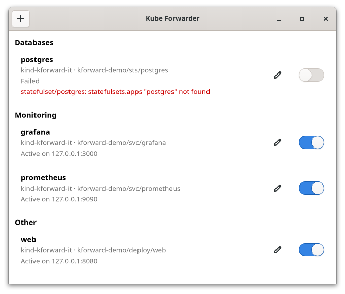

# kforward

[](https://github.com/gsontag/kforward/actions/workflows/ci.yml)

Keep your `kubectl port-forward`s running from the system tray.

kforward is a small Linux desktop application: each forward is a switch in
the tray menu, grouped as you like, and the icon shows how many are active.
When a pod goes away, the forward reconnects to the next ready one; when it
cannot, you get a notification.



## Features

- **Tray menu**: one switch per forward, optional groups, "Open in browser"
  for the forwards with a URL, "Stop all".
- **Icon badge**: the number of active forwards, green while connecting.
- **Window**: the state of every forward, and its last error.
- **Editor**: add, edit and delete forwards; namespaces, targets and ports
  are suggested from the cluster.
- **Reconnection**: follows the pods behind a service, a deployment or a
  statefulset when they are replaced; gives up after a few failures.
- **Notifications** when a forward stops for good, or when the configuration
  is wrong.
- **Live configuration**: the file is reloaded when edited by hand; only the
  forwards whose connection changed restart.
- **Log** of every change of state, in `~/.local/state/kforward/kforward.log`.
- **Start at login**, from the tray menu.
- English and French.

## Requirements

- Linux with a tray that supports StatusNotifierItem: KDE, XFCE, Cinnamon...
  On GNOME, the *AppIndicator and KStatusNotifierItem Support* extension
  (installed by default on Ubuntu).
- GTK 4.12 and GLib 2.46 or later, as in Ubuntu 24.04 and more recent
  distributions.
- A kubeconfig: kforward uses client-go, not the `kubectl` binary.

To build it:

- Go 1.27 or later
- a C compiler and `pkg-config` (the GTK bindings use cgo)
- the GTK 4 development files: `libgtk-4-dev` on Debian and Ubuntu, 
  `gtk4-devel` on Fedora

## Install

```sh
curl -fsSL https://raw.githubusercontent.com/gsontag/kforward/main/install.sh | sh
```

This downloads the latest release, checks it, and installs it for the current
user only:

- the program in `~/.local/bin/kforward`
- the launcher in `~/.local/share/applications`
- the icon in `~/.local/share/icons`

The release is built on Ubuntu 24.04, and runs on distributions at least as
recent; on older ones, build it from source.

To pick a version or another directory, set `KFORWARD_VERSION` or `PREFIX`:
`curl -fsSL https://raw.githubusercontent.com/gsontag/kforward/main/install.sh | KFORWARD_VERSION=v0.2.0 sh`. To uninstall:
`curl -fsSL https://raw.githubusercontent.com/gsontag/kforward/main/install.sh | sh -s -- --uninstall`. As for any script piped into a shell,
you can read [install.sh](install.sh) first.

### From source

```sh
git clone https://github.com/gsontag/kforward.git
cd kforward
make install
```

The first build takes a minute or two: client-go is large. Use
`make install PREFIX=/usr/local` (as root) for a system-wide install, and
`make uninstall` to remove it.

## Configuration

The forwards are stored in `~/.config/kforward/config.json`. The editor
writes it for you, but it is plain JSON:

```json
{
  "kubeconfig": "/home/me/.kube/config",
  "forwards": [
    {
      "uuid": "e1564734-b5df-43f4-826f-ee03d6d2931c",
      "name": "grafana",
      "group": "Monitoring",
      "context": "prod",
      "namespace": "monitoring",
      "target": "svc/grafana",
      "local-port": 3000,
      "remote-port": "http-web",
      "url": "http://localhost:3000",
      "auto-start": true
    }
  ]
}
```

| Field | Meaning |
|-------|---------|
| `kubeconfig` | Optional. Without it, `$KUBECONFIG` or `~/.kube/config`, as for kubectl. |
| `uuid` | Identifies the forward: required and unique. The editor generates it. |
| `name` | Shown in the menu. |
| `group` | Optional. Forwards with the same group are shown together. |
| `context`, `namespace` | Optional. Default: the current context, and its namespace. |
| `target` | `pod/NAME` (or just `NAME`), `svc/NAME`, `deploy/NAME` or `sts/NAME`. |
| `local-port` | The port on your machine. |
| `remote-port` | A port number, or a port name of the pod or the service. |
| `address` | Optional. The address to listen on; default `127.0.0.1`. |
| `url` | Optional. Adds the forward to "Open in browser". |
| `auto-start` | Start the forward with the application. |

## Command line

```sh
kforward                 # start in the tray and open the window
kforward --background    # start in the tray only, as at login
kforward --check         # check each forward against the cluster, then exit
kforward --forward NAME  # run one forward in the terminal, until Ctrl-C
```

Only one instance runs: launching kforward again opens the window of the
running one.

## Development

```sh
make help            # lists the targets
make all             # quality checks, build and unit tests
make it              # integration tests, on a dedicated kind cluster
make i18n-extract    # after changing a text, then translate and make i18n-merge
```

The integration tests need [kind](https://kind.sigs.k8s.io/) and Docker.
They create a cluster named `kforward-it`, with its own kubeconfig in `out/`:
your current context is left untouched. `make it-clean` deletes it.

The GTK code is kept thin. `internal/gtk` binds the few GTK functions
kforward uses, and is tested on a private Broadway display: install
`gtk4-broadwayd` (`libgtk-4-bin` on Debian and Ubuntu) to run these tests,
which are skipped without it. `internal/gui` and the `main` package use
these bindings; the menu, the window rows and the editor form are plain
data models, tested on their own.

## License

[MIT](LICENSE)
